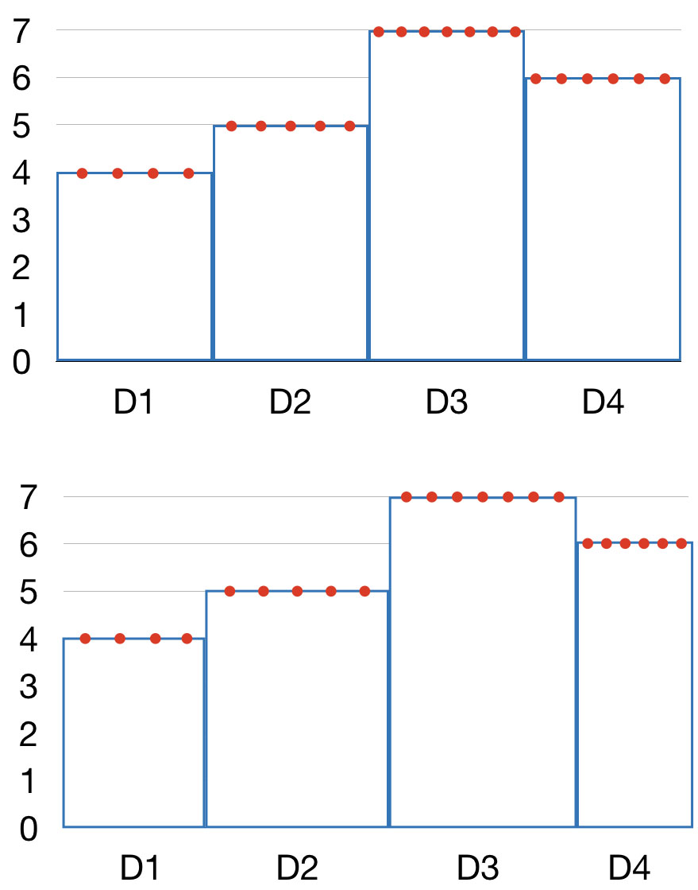
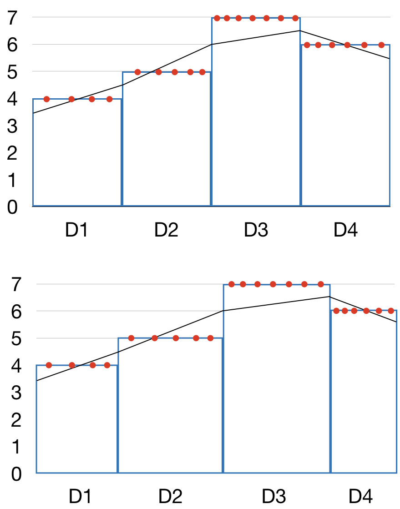

```{r setup, include=FALSE}
knitr::opts_chunk$set(echo=TRUE)
knitr::opts_chunk$set(comment=NA, fig.height=6, fig.width=7, fig.align='center')

# Remember that RStudio’s "Build & reload" does not build vignettes to
# save time. Use `devtools::build()` instead.
# Similarly, `devtools::install_github()` will also not build vignettes by
# default, so it need to be forced with
# `devtools::install_github(build_vignettes = TRUE)`.
```

------

# Introduction

`disdRo` is an R package for reading and basic handling of raw disdrometer data.

One day of raw data from a Thies Klima LPM disdrometer are provided in
directory tree under `extdata/rawDataThies`, in the package directory.
You can find the location of those files with
`system.file('extdata', 'rawDataThies', package='disdRo')`.
Similarly, sample data from a OTT Parsivel2 disdrometer can be found in
directory `extdata/rawDataParsivel`.

The `didRo` package contains some R functions for reading and handling rainfall
drop size and velocity distribution (PSVD), or disdrometric matrix data,
from the raw data files generated by Thies LPM or Parsivel optical
disdrometers.

A bunch of Perl scripts are also included under `perl` for computing
integrated variables from the raw data files.
These scripts would eventually be ported into `R`.

Example data files are stored on `extdata`.

-------

# Working with the PSVD matrix

We shall load the library to start:

```{r source}
library(disdRo)
```

The function `read_dsd()` retrieves minutal PSVD data from a list of raw
disdrometer data files.
For each minute, a matrix of velocity (rows) vs. size (columns) drop counts
is provided.


## Example with Thies LPM data

```{r thiesRawDataFiles, message=FALSE, warning=FALSE}
f <- system.file('extdata', 'rawDataThies', package='disdRo')
files <- list.files(f, '.txt', full.names=TRUE, recursive=TRUE)
PSVD <- dsd_read(files, type='Thies')
dim(PSVD)
```

Global aggregates can be obtained for the whole period (one day, in this case):

```{r globalCounts, message=FALSE, warning=FALSE}
day <- apply(PSVD, c(2,3), sum)
head(day)
barplot(colSums(day), main='Daily drop counts per size class')
barplot(rowSums(day), main='Daily drop counts per velocity class')
```

```{r timeCounts, message=FALSE, warning=FALSE}
time <- apply(PSVD, 1, sum)
barplot(time, main='Number of drops per minute')
```

The function `dsd_plot()` produces a drop count velocity vs. size plot from the
PSVD data.
The function interprets PSVD matrices from either Thies LPM or OTT Parsivel
devices, being `Thies` the default option.

```{r dsdPlot, message=FALSE, warning=FALSE}
dsd_plot(day, type='Thies')
```

It is possible to choose the theoretical models to plot on top of the PSVD
data:

```{r dsdPlot2, message=FALSE, warning=FALSE}
dsd_plot(day, model='VanDijk')
```

Or to plot no models at all:

```{r dsdPlot3, message=FALSE, warning=FALSE}
dsd_plot(day, model=NA)
```

The size of the bins in the previous plot correspond to those of the raw
matrix yielded by the disdrometer.
Interpolated 2D desnity contour lines can be plotted on top by setting parameter
`contour` to TRUE:

```{r dsdPlot4, message=FALSE, warning=FALSE}
dsd_plot(day, model=NA, contour=TRUE)
```

Finally, there is an option to produce the plots in black and white, setting
theme='bw'.

```{r dsdPlot5, message=FALSE, warning=FALSE}
dsd_plot(day, theme='bw')
```


## Example with Parsivel data

Data can also be read from a Parsivel or Parsivel2 disdrometer.
In this case, the parameter `type` of `dsd_read()` and `dsd_plot()` functions
can not be overriden, since Parsivel type is not the default option.

```{r parsivelExample, message=FALSE, warning=FALSE}
f <- system.file('extdata', 'rawDataParsivel', package='disdRo')
files <- list.files(f, '.txt.gz', full.names=TRUE, recursive=TRUE)
PSVD <- dsd_read(files, type='Parsivel')

day <- apply(PSVD, c(2,3), sum)
barplot(colSums(day), main='Daily drop counts per size class')
barplot(rowSums(day), main='Daily drop counts per velocity class')

time <- apply(PSVD, 1, sum)
barplot(time, main='Number of drops per minute')

dsd_plot(day, type='Parsivel')
```


## To do list

* A function to calculate the number density / drop concentration (1 m-3 mm-1)
* All the files need to conform to the format expected from the disdrometer;
there are frequent errors, especially on Parsivel files, that cause the function
to fail.


-------

# Working with the integrated variables

So far we have worked with the raw disdrometric matrix, or PSVD, but the
disdrometers also offer a series of integrated variables which are calculated
upon the raw matrix.
These include the precipitation intensity and cumulative amounts, the kinetic
energy released, the radar reflectivity, and others.
The function `dsd_integrate()` enables automatic and fast computation of
disdrometer integrated variables from raw disdrometer files.
It also performs a quality control, and reports on several status variables
recorded by the disdrometer.

Currently, this is done via an external Perl script, so you need to have
Perl installed and working in your system. Beware: some users have reported
issues for running the Perl script in Windows.
It might be translated into a native R script in the future, if I find time
to do it.
The script `process.pl` can be found in the directory where the `disdRo`
package was installed.
The perl script can be used in stand-alone way as follows:

`perl process.pl directory outfile (middle|uniform|linear)`

The first argument invokes the Perl interpreter, the second argument points to
the location of the script we want to run, the third argument points to the
directory containing the disdrometer data, and the fourth argument provides
a name of the output file to store the results.
In addition, it is possible to choose between `middle`, `uniform`, and `linear`,
which are different methods for estimating the distribution of drop sizes and
velocities within the limits of the bins in which the PSVD matrix is divided
(more on this later).

To use the `dsd_integrate()` function:

```{r perlscript, message=FALSE, warning=FALSE}
?dsd_integrate

f <- system.file('extdata', 'rawDataThies', package='disdRo')
int <- dsd_integrate(f)
summary(int)
```

Explanation of the variables in the data frame:

Num | Nombre    | Descripción                                  | Parsivel | Thies
--- | ------    | -----------                                  | -------- | -------
1   | type      | modelo del aparato                           | Si       | Si
2   | serial    | número de serie del aparato                  | Si       | Si
3   | time      | fecha y hora de la observación (POSIXct)     | Si       | Si
4   | seconds   | número de segundos desde 1970-01-01 00:00:00 | Si       | Si
5   | synop     | SYNOP code 4677                              | Si       | Si
6   | r         | calculated rain intensity, mm h-1            | Si       | Si
7   | p         | calculated precipitation amount, mm          | Si       | Si
8   | m         | calculated water content, g m3               | Si       | Si
9   | z         | calculated radar reflectivity, dB mm6 m-3    | Si       | Si
10  | e         | calculated kynetic energy, J m-2 mm-1        | Si       | Si
11  | mor       | calculated MOR visibility, m                 | Si       | Si
12  | r_meas    | measured rain intensity, mm h-1              | Si       | Si
13  | z_meas    | measured radar reflectivity, dB mm6 m-3      | Si       | Si
14  | e_meas    | measured kynetic energy, J m-2 mm-1          | Si       | No
15  | mor_meas  | measured MOR visibility, m                   | Si       | Si
16  | qual      | data quality, %                              | No       | Si
17  | tmp       | air temperature, ºC                          | No       | Opt
18  | rh        | relative air humidity, %                     | No       | Opt
19  | w         | wind velocity, m/s                           | No       | Opt
20  | wd        | wind direction, º                            | No       | Opt
21  | np        | number of particles detected (-)             | Si       | Si
22  | power     | sensor power supply (V)                      | Si       | Si
23  | tmp_int   | internal (sensor) temperature (ºC)           | Si       | Si
24  | d25       | drop diameter, 25 percentile (mm)            | Si       | Si
25  | d50       | drop diameter, 50 percentile (mm)            | Si       | Si
26  | d75       | drop diameter, 75 percentile (mm)            | Si       | Si
27  | dmean     | average drop diameter (mm)                   | Si       | Si
28  | v25       | drop velocity, 25 percentile (m/s)           | Si       | Si
29  | v50       | drop velocity, 50 percentile (m/s)           | Si       | Si
30  | v75       | drop velocity, 75 percentile (m/s)           | Si       | Si
31  | vmean     | average drop velocity (m/s)                  | Si       | Si
32  | t_shift   | telegram time shift (s)                      | Si       | Si
33  | nrow      | telegram line number                         | Si       | Si
34  | err       | error status code  (0, no error; 1, no data) | Si       | Si
35  | ncol      | number of telegram fields                    | Si       | Si

An NA value is obtained if the variable does not exist in the telegram.

List of the error codes:

Código | Descripción
---    | ------
0      | Sin error
1      | No hay telegrama para ese minuto
2      | Saturación en la matriz de los Thies
3      | Caracteres extraños en código SYNOP
4      | Caracteres extraños en rain intensity
5      | 9999.999 en rain intensity
6      | El telegrama sólo contiene 'OK' o 'Version' (¿reinicio del Parsivel?)
7      | Caracteres extraños en el telegrama
21-23  | Parsivel error codes 1 to 3
24-36  | Thies error codes 24 to 36
37     | Thies, multiple error codes

It is easy to plot the different variables:

```{r perlscript2, fig.height=12, fig.width=7, message=FALSE, warning=FALSE}
par(mfrow=c(3,1))
plot(int$r~int$time, type='l', xlab='', ylab='I (mm/h)',
     main='Precipitation rate')
plot(int$e~int$time, type='l', xlab='', ylab='ET (J m-2 mm-1)',
     main='Unit kinetic energy')
plot(int$z~int$time, type='l', xlab='', ylab='Z (dB mm6 m-3)',
     main='Radar reflectivity')
```

The output of `dsd_integrate()` contains the integrated variables computed from
the raw PSVD matrix, but also the same variables computed internally by the
disdrometer and reported in the telegram (if they exist).
These are distinguished by the suffix `_meas`.

```{r perlscript3, fig.height=8, fig.width=7, message=FALSE, warning=FALSE}
par(mfrow=c(2,1))
plot(int$z~int$time, type='l', xlab='', ylab='I (mm/h)',
     main='Precipitation rate (computed)')
plot(int$z_meas~int$time, type='l', xlab='', ylab='I (mm/h)',
     main='Precipitation rate (measured)')
```

```{r perlscript4, message=FALSE, warning=FALSE}
par(mfrow=c(1,1))
plot(int$z~int$z_meas, ylab='Calculated', xlab='Measured')
grid()
abline(0,1)
```

By converting the output object (a `data.frame`) to a temporal series object of
class `zoo`, it is easy to perform operations using the time as an index
variable, for instance extracting a specific event for which we know the
starting and ending times:

```{r window, fig.height=8, fig.width=7, message=FALSE, warning=FALSE}
library(zoo)
int <- zoo(int[,-c(1:3)], int$time)

event <- window(int, start='2013-06-07 28:00:00', end='2013-06-07 23:59:00')
plot(event[,c('r_meas','z_meas','d50')], type='l',
     xlab='', main='A precipitation event')
```

The computation of particle size and velocity percentiles (d25, d50, d75, v25,
v50 and v75) is shomewhat triky due to the binned character of the PSVD matrix.
Since all that is known is the number of particles detected within a range of
particle sizes or velocities, in order to compute size and velocity percentiles
there is a need to assign those particles specific values of size and velocity.
The easiest option would be to assing the mean value of the bin to all the
particles belonging to that class (see figure).
This is the default option for the argument on function `dsd_integrate()`,
equivalent to setting `interp='middle'`.

```{r echo=FALSE, out.width="400px"}
knitr::include_graphics('img/percentile_distribution.001.jpg')
```

This, however, leads to issues when two different bin configurations are
compared, for instante when comparing the output of two different disdrometer
types (such as Thies LPN and OTT Parsivel).
In order to get a better approximation to the size and velocity quantiles, two
interpolation methods have been used for de-binning the information on the
PSVD matrix.
The first option, corresponding to setting `interp='uniform'`, is a random
distribution of the detected particles over the range of values in the bin,
following a uniform probability distribution (see figure below).

```{r echo=FALSE, out.width="400px"}

```

The second option, corresponding to setting `interp='linear'`, is also a random
distribution over the range of values in the bin, but following a linear
probability distribution constructed by fitting a line between two points
determined as the average of the number of particles in the bin and the
corresponding values on the neighbouring bins.

```{r echo=FALSE, out.width="400px"}

```

In practical terms, there is little difference between the `uniform` and
`linear` options, and both methods correct in a satisfactory way the bias
introduced by the binning structure.


## To do list

* Integrate the call to the perl script in a wrapper function in R.