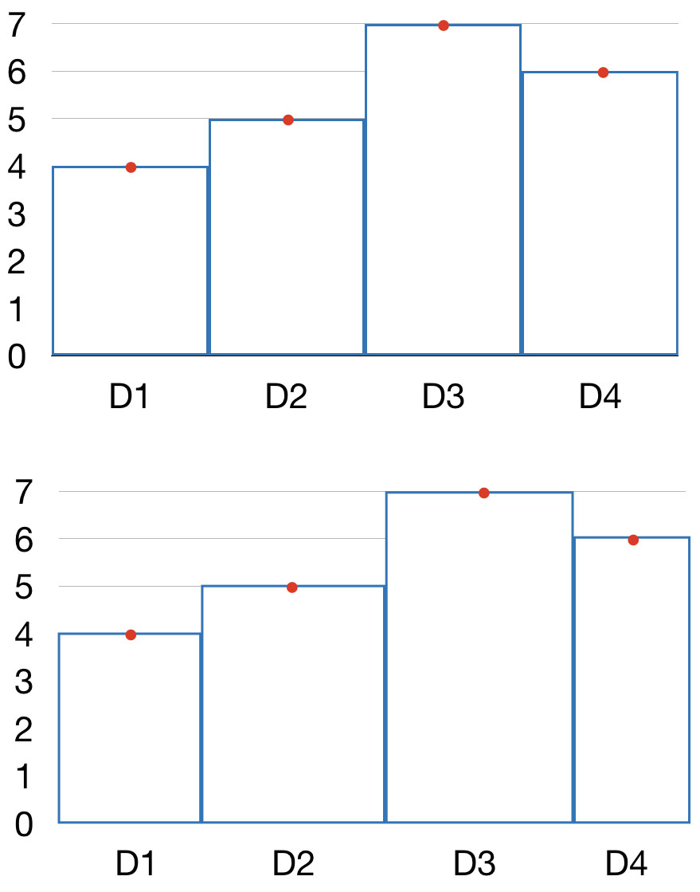

```{r setup, include=FALSE}
knitr::opts_chunk$set(echo=TRUE)
knitr::opts_chunk$set(comment=NA, fig.height=6, fig.width=7, fig.align='center')

# Remember that RStudio’s "Build & reload" does not build vignettes to
# save time. Use `devtools::build(vignettes=TRUE)` instead, or
# altrnatively: `tools::buildVignettes(dir='.', tangle=TRUE)`.
# Similarly, `devtools::install_github()` will also not build vignettes by
# default, so it need to be forced with
# `devtools::install_github(build_vignettes = TRUE)`.
```

------

# Introduction

`disdRo` is an R package for reading and basic handling of raw
disdrometer data.

As an example, one day of raw data from a Thies Klima LPM
disdrometer are provided in directory tree under `extdata/rawDataThies`,
in the package directory.
You can find the location of those files with
`system.file('extdata', 'rawDataThies', package='disdRo')`.
Similarly, sample data from a OTT Parsivel2 disdrometer can be found in
directory `extdata/rawDataParsivel`.

The `didRo` package contains some R functions for reading and handling
rainfall drop size and velocity distribution (PSVD), or disdrometric
matrix data, from the raw data files generated by Thies LPM or Parsivel
optical disdrometers.

A bunch of Perl scripts are also included in directory `perl` for
computing integrated variables from the raw data files.
These scripts would eventually be ported into `R`.

Example data files are stored on `extdata`.


-------

# Working with the PSVD matrix

We shall load the library to start:

```{r source}
library(disdRo)
```

The function `read_psvd()` retrieves minutal PSVD data from a list of raw
disdrometer data files.
For each minute, a matrix of size (rows) vs velocity (columns) particle
counts is provided.
When reading a directory tree containing many mintues of data, the result
is a three dimensional array with time in the first dimension.


## Example with Thies LPM data

```{r thiesRawDataFiles, message=FALSE, warning=FALSE}
f <- system.file('extdata', 'rawDataThies', package='disdRo')
files <- list.files(f, '.txt', full.names=TRUE, recursive=TRUE)
PSVD_T <- psvd_read(files, type='Thies')
dim(PSVD_T)
```

Global aggregates for the whole period (one day, in this case) can be
obtained easily from this array, for instance using `apply`. For instance,
we can represent the distribution of particle size and velocities using
bar plots:

```{r globalCounts, message=FALSE, warning=FALSE}
day_T <- apply(PSVD_T, c(2,3), sum)
head(day_T)

barplot(colSums(day_T), main='Daily drop counts per size class')
barplot(rowSums(day_T), main='Daily drop counts per velocity class')
```

Or the more conventional PSVD logarithmic scatter:

```{r logDSDscatter, message=FALSE, warning=FALSE}
plot(log10(colSums(day_T))~colnames(day_T), ylab='log10(N)', xlab='size (mm)', type='b')
grid()
```

Time aggregation:

```{r timeCounts, message=FALSE, warning=FALSE}
time <- apply(PSVD_T, 1, sum)
barplot(time, main='Number of drops per minute')
```

The function `psvd_plot()` produces a drop count velocity vs. size plot from the
PSVD data.
The function interprets PSVD matrices from either Thies LPM or OTT Parsivel
devices, being `Thies` the default option.

```{r dsdPlot, message=FALSE, warning=FALSE}
psvd_plot(day_T, type='Thies')
```

It is possible to choose one or more theoretical models to plot on top of the PSVD
data. One of the best models is the one of Beard (1978):

```{r dsdPlot2, message=FALSE, warning=FALSE}
psvd_plot(day_T, model='Beard')
```

The Beard model of terminal drop velocity is a physical approximation accounting
for different factors such as viscous drag, drop oblateness, and others. The
function implemented here is valid for drop sizes between 0.019 mm (19 µm) up to
7 mm.  The Beard model is implemented by default assuming a standard atmosphere:
P=101.325 kPa, T=288.15 K, and rho= 1.225 kg/m3, but other values can be provided
for these parameters, since they affect the critical velocity of falling meteors.
It is advisable, at least, to specify the altitude of the site where the data was
acquired, because this will be used by the function to calculate the other factors,
assuming a standard atmosphere. See, for instance, the different fall velocity
models at sea level (the default, shown above) and at 2000 meter above sea level:

```{r dsdPlot3, message=FALSE, warning=FALSE}
psvd_plot(day_T, model='Beard', alt=2000)
```

The Beard model of particle fall velocity is implemented in function `psvd_model`.
This function also contains the approximations by Atlas, Uplinger and Van Dijk,
but these are limited to a shorter range of particle sizes and are less flexible
with respect to variations from the standard atmosphere.

The size of the bins in the previous plot correspond to those of the raw
matrix yielded by the disdrometer.
Interpolated 2D desnity contour lines can be plotted on top by setting parameter
`contour` to TRUE:

```{r dsdPlot4, message=FALSE, warning=FALSE}
psvd_plot(day_T, model=NA, contour=TRUE)
```

Finally, there is an option to produce the plots in black and white, setting
theme='bw'.

```{r dsdPlot5, message=FALSE, warning=FALSE}
psvd_plot(day_T, theme='bw')
```


## Example with Parsivel data

Data can also be read from a Parsivel or Parsivel2 disdrometer.
In this case, the parameter `type` of `psvd_read()` and `psvd_plot()` functions
can not be overriden, since Parsivel type is not the default option.

Note: So far, it is assumed that the data consists on the complete telegram is
recorded, which may not correspond to the factory settings.
Custom definition of the telegram has not been implemented yet.

```{r parsivelExample, message=FALSE, warning=FALSE}
f <- system.file('extdata', 'rawDataParsivel', package='disdRo')
files <- list.files(f, '.txt.gz', full.names=TRUE, recursive=TRUE)
PSVD_P <- psvd_read(files, type='Parsivel')

day_P <- apply(PSVD_P, c(2,3), sum)
barplot(colSums(day_P), main='Daily drop counts per size class')
barplot(rowSums(day_P), main='Daily drop counts per velocity class')

plot(log10(colSums(day_P))~colnames(day_P), ylab='log10(N)', xlab='size (mm)', type='b')
grid()

time <- apply(PSVD_P, 1, sum)
barplot(time, main='Number of drops per minute')

psvd_plot(day_P, type='Parsivel', model='Beard')
```


## Filters

Disdrometer data are not devoid of errors. Especially, partial detections of
particles falling at the edge of the laser beam (a.k.a. 'margin fallers', or
'edge events') are detected as smaller particles at super-critical velocity;
and double detections of particles overlapping in time are detected as larger
particles at sub-critical velocity. These events, which increase in frequency
as the precipitation intensity increases, appear as deviations from the
theoretical fall velocity model, and cause distortions and biases in the
calculation of PSVD moments ('integrated variables').

Thus, the raw PSVD matrix is usually filtered to remove unlikely particle size
and velocity combinations. Here, the function `psvd_filter` allows defining a
filter that can be applied to PSVD data. It creates a matrix that is used as a
mask in further calculations that involve using the PSVD matrix data.

PSVD filters can be produced for Thies or Parsivel disdrometers. Very small or
large particles can be removed by setting particle size limits, and velocity
limits can be set in a similar way. For instance, to produce a filter that
will remove all particles smaller than 0.3 mm. In the image, red represents the
data that will be filtered out:

```{r filter1, message=FALSE, warning=FALSE}
flt <- psvd_filter(type='Thies', d=c(0.3,Inf))
image(flt)
```

Apart from setting limits to the particle size and velocity, the most
interesting option consists on removing all the size and velocity combinations
(bins) that are far from a theoretical fall velocity model. The model of Beard
(1976) is used by default, although other models can be selected that are
basically approximations to this model. The parameter `tau` determines the
degree of filtering applied. Its default value is 0.5, implying that all
bins with velocity 50% different from the theoretical model will be removed.
All the atmospheric parameters available in the Beard model can also be
set to build the filter:

```{r filter2, message=FALSE, warning=FALSE}
flt <- psvd_filter(type='Thies', tau=0.5, alt=2000)
image(flt)
```

The filter can then be used in combination with the other functions. For instance,
see the differences in the PSVD spectra of the Thies data, when the unlikely
particles are filtered out (compare the following figure with the one obtained
before):

```{r psvdPlotFilter, message=FALSE, warning=FALSE}
psvd_plot(day_T, model='Beard', filter=flt, alpha=0)
```


## Particle size distribution

The funtion `psd_plot` produces a particle size distribution plot. The
particle density (i.e., the number of drops per m^3 of air and mm of rain)
is represented against the particle size, using a logaritmic Y axis.

```{r psdPlot1, message=FALSE, warning=FALSE}
psd_plot(day_T)
```

Compare the effect of filtering in the PSD plot:

```{r psdPlot2, message=FALSE, warning=FALSE}
psd_plot(day_T, filter=flt)
```


## Particle velocity distribution

The funtion `pvd_plot` produces a particle velocity distribution plot. The
particle density (i.e., the number of drops per m^3 of air and mm of rain)
is represented against the particle velocity.

```{r pvdPlot1, message=FALSE, warning=FALSE}
pvd_plot(day_T)
```

Compare the effect of filtering in the PVD plot:

```{r pvdPlot2, message=FALSE, warning=FALSE}
pvd_plot(day_T, filter=flt)
```


## To do list

* All the files need to conform to the format expected from the disdrometer;
there are frequent errors, especially on Parsivel files, that cause the function
to fail.
* Possibility to define custom telegrams.
* Include indices (convectivity, etc).
* Implement fit to Gamma distribution (Braun & Upton).


-------

# Working with the integrated variables

So far we have worked with the raw disdrometric matrix, or PSVD, but the
disdrometers also offer a series of integrated variables which are calculated
upon the raw matrix.
These include the precipitation intensity and cumulative amounts, the kinetic
energy released, the radar reflectivity, and others.
The function `dsd_integrate()` enables automatic and fast computation of
disdrometer integrated variables from raw disdrometer files.
It also performs a quality control, and reports on several status variables
recorded by the disdrometer.

Currently, this is done via an external Perl script, so you need to have
Perl installed and working in your system. Beware: some users have reported
issues for running the Perl script in Windows.
It might be translated into a native R script in the future, if I find time
to do it.
The script `process.pl` can be found in the directory where the `disdRo`
package was installed.
The perl script can be used in stand-alone way as follows:

`perl process.pl directory outfile (middle|uniform|linear)`

The first argument invokes the Perl interpreter, the second argument points to
the location of the script we want to run, the third argument points to the
directory containing the disdrometer data, and the fourth argument provides
a name of the output file to store the results.
In addition, it is possible to choose between `middle`, `uniform`, and `linear`,
which are different methods for estimating the distribution of drop sizes and
velocities within the limits of the bins in which the PSVD matrix is divided
(more on this later).

To use the `dsd_integrate()` function:

```{r perlscript, message=FALSE, warning=FALSE}
?dsd_integrate

f <- system.file('extdata', 'rawDataThies', package='disdRo')
int <- psvd_integrate(f)
summary(int)
```

Explanation of the variables in the data frame:

Num | Nombre    | Descripción                                  | Parsivel | Thies
--- | ------    | -----------                                  | -------- | -------
1   | type      | modelo del aparato                           | Si       | Si
2   | serial    | número de serie del aparato                  | Si       | Si
3   | time      | fecha y hora de la observación (POSIXct)     | Si       | Si
4   | seconds   | número de segundos desde 1970-01-01 00:00:00 | Si       | Si
5   | synop     | SYNOP code 4677                              | Si       | Si
6   | r         | calculated rain intensity, mm h-1            | Si       | Si
7   | p         | calculated precipitation amount, mm          | Si       | Si
8   | m         | calculated water content, g m3               | Si       | Si
9   | z         | calculated radar reflectivity, dB mm6 m-3    | Si       | Si
10  | e         | calculated kynetic energy, J m-2 mm-1        | Si       | Si
11  | mor       | calculated MOR visibility, m                 | Si       | Si
12  | r_meas    | measured rain intensity, mm h-1              | Si       | Si
13  | z_meas    | measured radar reflectivity, dB mm6 m-3      | Si       | Si
14  | e_meas    | measured kynetic energy, J m-2 mm-1          | Si       | No
15  | mor_meas  | measured MOR visibility, m                   | Si       | Si
16  | qual      | data quality, %                              | No       | Si
17  | tmp       | air temperature, ºC                          | No       | Opt
18  | rh        | relative air humidity, %                     | No       | Opt
19  | w         | wind velocity, m/s                           | No       | Opt
20  | wd        | wind direction, º                            | No       | Opt
21  | np_meas   | measured number of particles detected (-)    | Si       | Si
22  | np        | number of particles detected (-)             | Si       | Si
23  | lcurrent  | current throught the laser
24  | ocontrol  |
23  | power     | sensor power supply (V)                      | Si       | Si
24  | status    | sensor status code (see table)               | Si       | Si
25  | tmp_int   | internal (sensor) temperature (ºC)           | Si       | Si
25  | d10       | drop diameter, 10 percentile (mm)            | Si       | Si
25  | d25       | drop diameter, 25 percentile (mm)            | Si       | Si
26  | d50       | drop diameter, 50 percentile (mm)            | Si       | Si
27  | d75       | drop diameter, 75 percentile (mm)            | Si       | Si
27  | d90       | drop diameter, 90 percentile (mm)            | Si       | Si
28  | dmean     | average drop diameter (mm)                   | Si       | Si
29  | v10       | drop velocity, 10 percentile (m/s)           | Si       | Si
29  | v25       | drop velocity, 25 percentile (m/s)           | Si       | Si
30  | v50       | drop velocity, 50 percentile (m/s)           | Si       | Si
31  | v75       | drop velocity, 75 percentile (m/s)           | Si       | Si
29  | v90       | drop velocity, 90 percentile (m/s)           | Si       | Si
32  | vmean     | average drop velocity (m/s)                  | Si       | Si
33  | nd1       | numer density of 1st diameter class (m-3 mm-1) | Si     | Si
33  | t_shift   | telegram time shift (s)                      | Si       | Si
34  | nrow      | telegram line number                         | Si       | Si
35  | err       | error status code (see table)                | Si       | Si
36  | ncol      | number of telegram fields                    | Si       | Si

An NA value is obtained if the variable does not exist in the telegram.

List of the sensor status codes:

Code   | Parsivel
---    | ------
0      | Sensor OK
1      | Sensor requires cleaning, but data are still OK
2      | Sensor requires cleaning, data might be wrong
3      | Laser damaged

Code   | Thies
---    | ------
0      | Sensor OK
1      | Sensor damaged

List of the error codes:

Code   | Description
---    | ------
0      | No error
1      | There are no data for that minute (NA)
2      | Saturation (more than 999 drops) in the DSVD matrix (Thies)
3      | Strange characters in the SYNOP code field
4      | Strange characters in rain intensity field
5      | 9999.999 in rain intensity field
6      | The telegram only contains 'OK' o 'Version' (possible restart of Parsivel?)
7      | There are strange characters somewhere in the telegram

It is easy to plot the different variables:

```{r perlscript2, fig.height=12, fig.width=7, message=FALSE, warning=FALSE}
par(mfrow=c(3,1))
plot(int$r~int$time, type='l', xlab='', ylab='I (mm/h)',
     main='Precipitation rate')
plot(int$e~int$time, type='l', xlab='', ylab='ET (J m-2 mm-1)',
     main='Unit kinetic energy')
plot(int$z~int$time, type='l', xlab='', ylab='Z (dB mm6 m-3)',
     main='Radar reflectivity')
```

The output of `dsd_integrate()` contains the integrated variables computed from
the raw PSVD matrix, but also the same variables computed internally by the
disdrometer and reported in the telegram (if they exist).
These are distinguished by the suffix `_meas`.

```{r perlscript3, fig.height=8, fig.width=7, message=FALSE, warning=FALSE}
par(mfrow=c(2,1))
plot(int$z~int$time, type='l', xlab='', ylab='I (mm/h)',
     main='Precipitation rate (computed)')
plot(int$z_meas~int$time, type='l', xlab='', ylab='I (mm/h)',
     main='Precipitation rate (measured)')
```

```{r perlscript4, message=FALSE, warning=FALSE}
par(mfrow=c(1,1))
plot(int$z~int$z_meas, ylab='Calculated', xlab='Measured')
grid()
abline(0,1)
```

By converting the output object (a `data.frame`) to a temporal series object of
class `zoo`, it is easy to perform operations using the time as an index
variable, for instance extracting a specific event for which we know the
starting and ending times:

```{r window, fig.height=8, fig.width=7, message=FALSE, warning=FALSE}
library(zoo)
int <- zoo(int[,-c(1:3)], int$time)

event <- window(int, start='2013-06-07 28:00:00', end='2013-06-07 23:59:00')
plot(event[,c('r_meas','z_meas','d50')], type='l',
     xlab='', main='A precipitation event')
```

The computation of particle size and velocity percentiles (d25, d50, d75, v25,
v50 and v75) is shomewhat triky due to the binned character of the PSVD matrix.
Since all that is known is the number of particles detected within a range of
particle sizes or velocities, in order to compute size and velocity percentiles
there is a need to assign those particles specific values of size and velocity.
The easiest option would be to assing the mean value of the bin to all the
particles belonging to that class (see figure).
This is the default option for the argument on function `dsd_integrate()`,
equivalent to setting `interp='middle'`.

```{r echo=FALSE, out.width="400px"}

```

This, however, leads to issues when two different bin configurations are
compared, for instante when comparing the output of two different disdrometer
types (such as Thies LPN and OTT Parsivel).
In order to get a better approximation to the size and velocity quantiles, two
interpolation methods have been used for de-binning the information on the
PSVD matrix.
The first option, corresponding to setting `interp='uniform'`, is a random
distribution of the detected particles over the range of values in the bin,
following a uniform probability distribution (see figure below).

```{r echo=FALSE, out.width="400px"}

```

The second option, corresponding to setting `interp='linear'`, is also a random
distribution over the range of values in the bin, but following a linear
probability distribution constructed by fitting a line between two points
determined as the average of the number of particles in the bin and the
corresponding values on the neighbouring bins.

```{r echo=FALSE, out.width="400px"}
knitr::include_graphics('img/percentile_distribution.003.jpg')
```

In practical terms, there is little difference between the `uniform` and
`linear` options, and both methods correct in a satisfactory way the bias
introduced by the binning structure.


## To do list

* Explain the option to use filters to remove unlikely particle size and
velocity combinations, and the correction of the effective sampling area.
* Integrate the call to the perl script in a wrapper function in R.